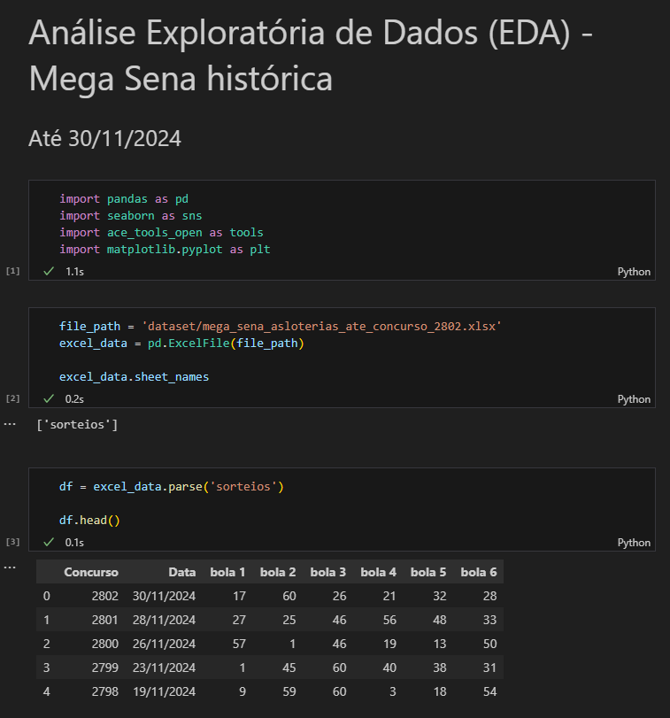
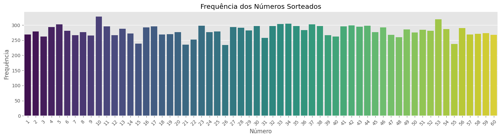
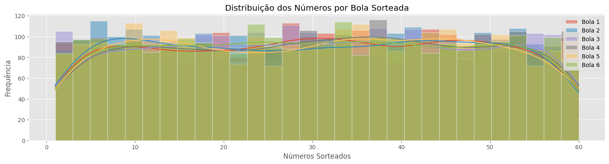
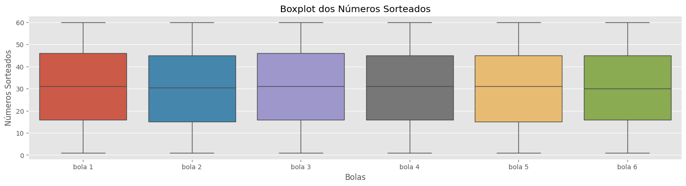
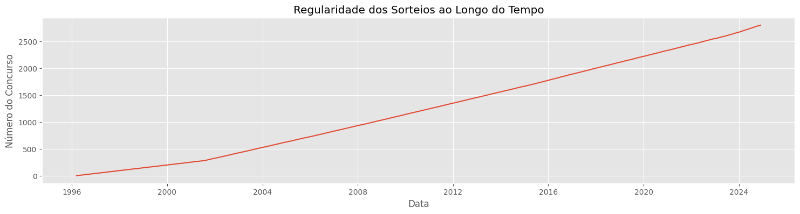
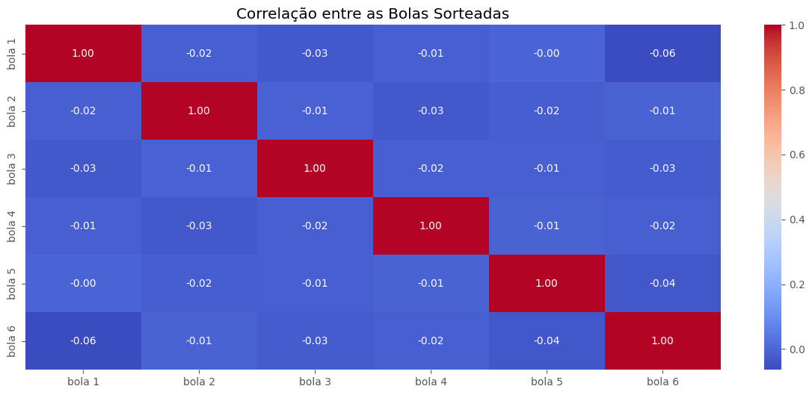
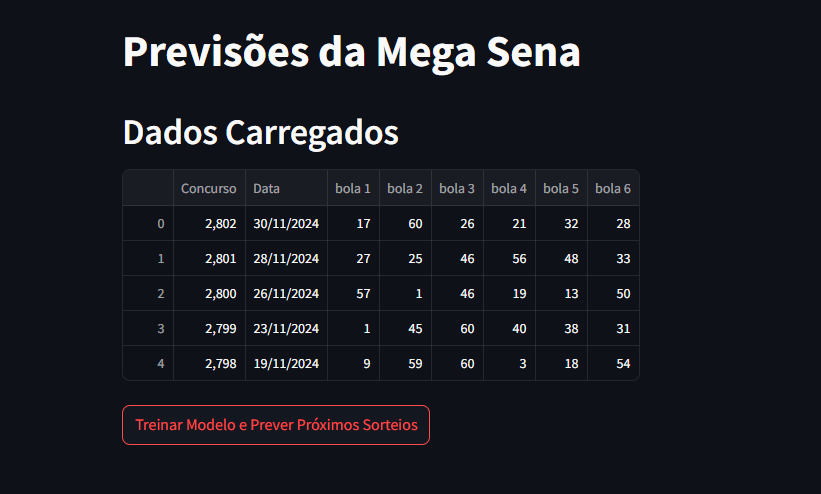

# Previsão de Sorteios da Mega Sena com RandomForestClassifier


### 🔖 Sobre

Este repositório reúne um notebook `.ipynb` com uma EDA, criação, treino e teste de um modelo RandomForestClassifier para previsão de sorteio dos números da Mega Sena com base no histórico: [DataSet](dataset/mega_sena_asloterias_ate_concurso_2802.xlsx) - (`mega_sena_asloterias_ate_concurso_2802.xlsx`), junto com um arquivo Python que gera uma aplicação Streamlit de previsão dos próximos 12 sorteios.

## Utilização
#### 1. Clonar o repositório em seu diretório:
```bash
git clone https://github.com/ersjunior/megasenaprev.git
```

#### 2. Criar um ambiente virtual dentro do diretório:
```python
python -m venv venv
```

#### 3. Ativar o ambiente virtual:
```python
venv/Scripts/activate
```

#### 4. Instalar o pacote de bibliotecas (`requirements.txt`) para utilizar a aplicação Streamlit:
```python
pip install -r requirements.txt
```

#### 5. Executar a aplicação no seu ambiente:
```python
streamlit run ms_forecast.py
```

## Análise Exploratória dos Dados `(EDA)` e Aplicação Streamlit
#### 1. Notebook com o projeto detalhado:

[ Notebook](/EDA.ipynb)

    Nootebook Python

<hr style='margin-top: 10px; margin-bottom: 10px;'>

    Análise Exploratória de Dados (EDA)
<div style="display: flex; flex-wrap: wrap; justify-content: center; gap: 0px;">

  <!-- Primeira linha -->
  
  

  <!-- Segunda linha -->
  
  

  <!-- Centralizado na terceira linha -->
  

</div>
<hr style='margin-top: 10px;'>

#### 2. Aplicação Streamlit:
[ Aplicação](/ms_forecast.py)


<hr style='margin-top: 10px;'>

## Pacotes utilizados
* [Pandas](https://pandas.pydata.org/) 2.2.3 (`pip install pandas`)
* [NumPy](https://numpy.org/) 2.0.2 (`pip install numpy`)
* [JobLib](https://joblib.readthedocs.io/en/stable/) 1.4.2 (`pip install joblib`)
* [Seaborn](https://seaborn.pydata.org/) 0.13.2 (`pip install seaborn`)
* [MatplotLib](https://matplotlib.org/stable/index.html) 3.9.3 (`pip install matplotlib`)
* [Scikit-Learn](https://scikit-learn.org/stable/index.html) 1.5.2 (`pip install -U scikit-learn`)
* [Ace Tools Open](https://github.com/zinccat/ace_tools_open) 0.1.0 (`pip install ace-tools-open`)
* [StreamLit](https://streamlit.io/) 1.40.2 (`pip install streamlit`)


### Criador
<hr style='margin-top: -10px; margin-bottom: 10px;'>

[<br>Eliézer Junior](https://github.com/ersjunior)